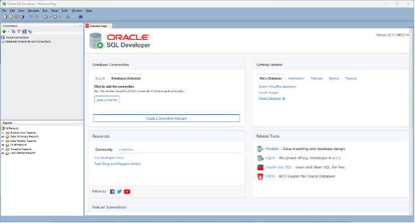

# Learn SQL by Using Oracle Express

Learning SQL programming by using Oracle Express.

## Required Software and Tools

Make sure you have the following software/tools in your computer.

- Docker Desktop [(Download now)](https://www.docker.com/products/docker-desktop/)
- Oracle SQL Developer [(Download now)](https://www.oracle.com/database/sqldeveloper/technologies/download/)
- Windows PowerShell
- Visual Studio Code or other code editor [(Download now)](https://code.visualstudio.com/download)

## Run Docker Desktop

Start Docker Desktop and keep it running.


## Run PowerShell

Click **Windows** button and search for `powershell`


A powershell session looks like below.


## Pull Oracle Express docker image

In powershell, type the following command to download the latest version of Oracle Express docker image

`docker pull container-registry.oracle.com/database/express:latest`

## Run Oracle Express Container

Type the following command to run Oracle Express docker container in background.

```
docker run `
   -d `
   --name oracle-on-docker `
   -p 1521:1521 `
   -e ORACLE_PWD=welcome123 `
   container-registry.oracle.com/database/express:latest
```

The container is name `oracle-on-docker`. A default `system` user will be automatically created. The password will be `welcome123`. We will use these details later for creating database connection from SQL Developer.

## Some frequent used docker commands

- `docker ps` : shows running containers
- `docker ps -a` : shows all containers (running & stopped)
- `docker run` : create and run a new container
- `docker stop` : stop a running container (e.g. `docker stop f09` where `f09` is the container id.)
- `docker start` : start a container that has been stopped (e.g. `docker start f09` where `f09` is the container id.)

## Start Oracle SQL Developer

Oracle SQL Developer is a free, integrated development environment that simplifies the development and management of Oracle Database.

Below is the starting screen of Oracle SQL Developer


### Create database connection

From starting screen, choose **Create a Connection Manually**


### Input the following connection details

**Name**: `Oracle on Docker`

**Username**: `system`

**Password**: `welcome123`

**Choose checkbox**: `Save Password`

**Hostname**: `localhost`

**Port**: `1521`

**SID**: `xe`


### Test if the connection details are correct

After entering the connection details, please **Test** button to test if connection can be established.

If the test fails, check if you've entered the correct connection details. Or in powershell, type `docker ps` to see if oracle container is running.


### Connect to Oracle Express that runs on docker

After successful connection testing, choose **Connect** to establish connection to Oracle Express that runs on docker.

Once connected, you will see the following Windows with SQL windows in the middle of screen that you can start working on some SQL commands.


### Enable DBA view

From main menu, choose **View -> DBA**


## Explore your connected Oracle database

Clicking at **+** icon in front of your connected Oracle instance, it will expand to show all the objects belong to your Oracle instance.


Clicking at the **Tables** object, it will expand to show all the tables in your oracle database.


## Let's type some SQL statements

You can start typing some SQL statment in the query window that was automatically open when your connection successfully established.


Type the following SQL query

`SELECT * FROM dba_users;`

Press the run button . It will list all the database users of your oracle database.


Let's try some more SQL. Type the following SQL statements one by one to see the result.

`SELECT * FROM DICT;` : shows dictionary tables

`select * from TAB;` : shows all table listing

`select * from COL; ` : shows all the coumns in your database

Data dictionaries are tables in your database that serves to describe the structure of your database.

`select * from DBA_TABLES ;` : shows all DBA tables

`select * from DBA_OBJECTS ;` : shows all DBA objects

`select * from USER_TABLES ;` : shows all users tables

`select * from USER_OBJECTS ;` : shows all user objects

## Create a regular database user account

Up to now, we've been using **system** which is a administrative user. It's not a good idea that we alwasy use administrator account as system user has high previledges that can easily lead to unrecoverable mistakes.

Now let's create a regular user and use that regular user to perform non-admin tasks.

Type the following SQL statement to create a new oracle account.

`CREATE USER c##STUDENT IDENTIFIED BY student`

Type the following SQL statments to grand permissions to the new account

```
GRANT CONNECT TO c##STUDENT;
GRANT CREATE SESSION TO c##STUDENT;
GRANT CREATE TABLE TO c##STUDENT;
GRANT UNLIMITED TABLESPACE TO c##STUDENT;
```

# Create another Connection using the new user account

Go back the welcome page.

From starting screen, choose **Create a Connection Manually**


Input the following user details for new connection

**Name** : `STUDENT`

**Username** : `c##STUDENT`

**Password** : `student`


Now we have **two** database connections at the same time. One connected as `system` user and the other one connected as `c##STUDENT` user.

From now on, we are going to do our tasks on the `c##STUDENT` connection.
